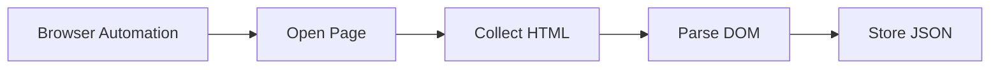
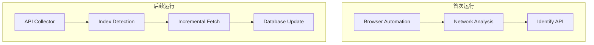
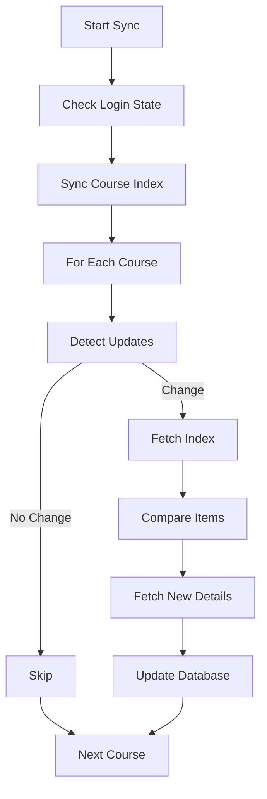

# UCAS 课程助手：增量同步与采集优化计划

## 1. 背景与问题

当前系统依赖浏览器自动化完成采集：登录平台、进入课程页、抓取 HTML、解析 JSON、写入数据库。该流程可用，但在周期性同步场景下成本过高。

### 1.1 当前同步模式

课程列表页 -> 逐门课程 -> 子页面（公告/作业/资料）-> 抓取 HTML -> 解析 JSON

即使并发采集，整体同步仍常超过 1 分钟。

### 1.2 核心瓶颈

1. 浏览器加载和渲染成本高。
2. 每次都做全量扫描。
3. 详情页抓取比例过高。
4. 轮询周期长但单次开销仍大。

目标升级方向：`接口驱动 + 增量同步`。

---

## 2. 目标与预期

### 2.1 目标能力

- 首次同步：完整抓取。
- 后续同步：先检测，再增量拉取。
- 仅拉取新增或变化内容。
- 尽量避免打开页面。

### 2.2 性能目标

- 轻量检测：`1~3s`
- 深度同步：`5~10s`

---

## 3. 架构升级

### 3.1 旧架构



### 3.2 新架构



---

## 4. 同步策略（三层）

1. 更新检测层：先判断是否变化。
2. 列表同步层：同步索引并识别变化项。
3. 详情同步层：仅拉取新增/变更详情。

### 4.1 更新检测（Index Detection）

检测对象：课程列表、公告列表、作业列表、资料列表。

检测规则：

1. 列表哈希：对前 N 条关键字段（如 `title + publish_time`）计算 `SHA1`。
2. 最新 ID：比较 `newest_id` 与本地 `latest_item_id`。
3. 更新时间：比较服务端更新时间与本地 `latest_update_time`。

任一规则判定无变化即可跳过后续抓取。

### 4.2 列表同步

当检测到变化后，仅同步索引页，更新以下关键字段：

- `id`
- `title`
- `publish_time`
- `update_time`

产出：新增项、变更项集合。

### 4.3 详情同步

仅拉取新增/变更详情：

- `new_items = server_list - local_list`
- 请求 `new_items.details`

---

## 5. 同步状态设计

建议新增表：`sync_state`

字段：

- `resource_type`
- `course_id`
- `latest_item_id`
- `latest_update_time`
- `etag`
- `last_modified`
- `content_hash`
- `last_sync_time`

用途：支撑增量判断、缓存验证与失败恢复。

---

## 6. 同步流程



---

## 7. 调度策略

- 当前：`1h` 全量扫描。
- 优化后：
  - 每 `5~10 min` 轻量检测（课程列表 + 公告第一页 + 作业第一页）。
  - 每 `1h` 深度同步（含必要详情）。

---

## 8. 异常与回退

回退链路：`api_collector -> browser_collector`

触发条件：

- 接口返回异常。
- 接口结构变化。
- JSON 解析失败。
- HTTP `401/403`。

回退后由浏览器采集器重新建立可用数据与接口线索。

---

## 9. 实施步骤

### 9.1 网络请求分析

使用 Playwright 监听：

- `page.on("request")`
- `page.on("response")`

记录：`URL`、`method`、`headers`、响应 JSON。

目标识别：课程列表、公告列表、作业列表、资料列表 API。

### 9.2 实现 API Collector

实现以下模块：

- `syncCourseIndex()`
- `syncAnnouncementIndex()`
- `syncAssignmentIndex()`
- `syncMaterialIndex()`

### 9.3 实现增量逻辑

纳入并持久化：`latest_id`、`update_time`、`hash`。

### 9.4 落地同步状态表

创建 `sync_state` 并接入采集流程。

### 9.5 构建回退机制

API 同步失败时自动切换到浏览器采集。

---

## 10. 最终系统结构

```text
UCAS Assistant
├── UI Layer
├── Sync Scheduler
├── API Collector
├── Browser Collector
├── Parser Layer
└── SQLite Database
```

---

## 11. 关键原则

1. 优先 API，不依赖 HTML。
2. 先检测变化，再执行抓取。
3. 先同步索引，再同步详情。
4. 持久化同步状态。
5. 始终保留浏览器回退。

---

## 12. 下一阶段工作

- 完成网络请求分析与 API 识别。
- 实现三层增量同步逻辑。
- 建立并验证 `sync_state`。
- 接入异常回退并做端到端压测。
