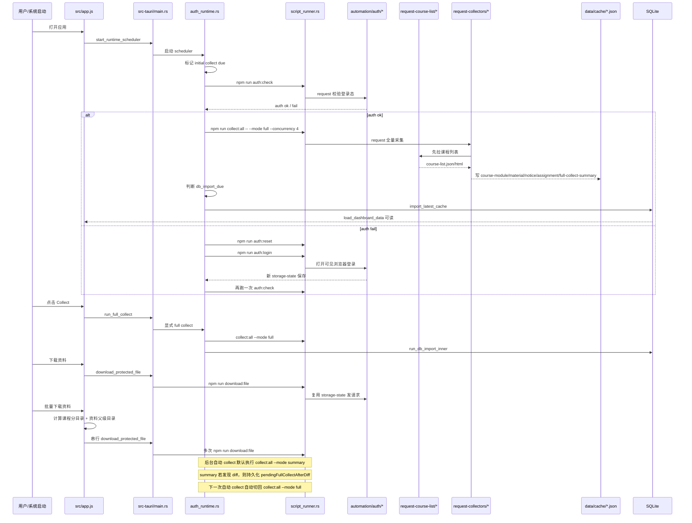

# UCAS Classer 程序 Map

## 0. 2026-03-13 / v1.0.4 补充

- 主窗口运行链已新增“自动侧收”子状态机：`normal -> collapsed -> expanded -> normal`。
- 侧收职责当前分层为：
  - 前端 `src/index.html` / `src/app.js` / `src/styles.css` 负责设置开关、边缘短条 UI、hover 收回计时与状态呈现。
  - 开发端与 package 壳层 `main.rs` 负责窗口几何读取、左右边缘判定、展开/收起尺寸恢复、窗口插值动画与托盘重开恢复。
- 侧收判定当前基于窗口外框与当前显示器 `work_area` 左右边缘的区间命中，不依赖鼠标坐标。
- 设置弹窗当前已收口为“内容区 -> 反馈 -> 操作按钮”的底部 footer 结构；课程范围与自动侧收为点击即生效项。
- package 壳层与开发端壳层的窗口行为已重新对齐；共享层继续通过同步脚本下发。

## 0.1 2026-03-14 / 前端状态流审计补充

- 已新增前端专项审计文档：`docs/frontend-state-audit.md`。
- 当前已确认的前端复杂度热点集中在：
  - Tauri 调用桥接的多层兜底
  - dock 状态的事件 / 轮询 / 手动刷新并存
  - runtime/download 状态框的重复派生
  - settings modal 内多种保存模式并存
- 该审计结论属于“下一轮前端重构施工图”，不是功能层 bug 清单。

## 0.2 2026-03-15 / 前端模块拆分补充

- `src/app.js` 已从单文件控制器开始拆成 ES module 结构。
- 当前新增的前端内部模块包括：
  - `src/app/bridge.js`
  - `src/app/course-renderer.js`
  - `src/app/detail-controller.js`
  - `src/app/download-controller.js`
  - `src/app/formatters.js`
  - `src/app/modal-ui.js`
  - `src/app/state-models.js`
  - `src/app/path-utils.js`
  - `src/app/settings-controller.js`
  - `src/app/settings-save.js`
  - `src/app/dock-controller.js`
- `src/app.js` 当前主要保留页面编排、controller 组装和主流程入口，已不再承担 settings / download / detail / course render 的具体实现。
- 当前前端已进入“模块职责清晰、下一步按模块删冗余”的阶段，后续重点不再是继续拆文件，而是开始审计 Rust / TS 主线。
<!-- markdownlint-disable MD013 MD033 -->

## 1. 基线与范围

### 1.0 2026-03-12 / v1.0.3 补充

- 当前前端下载链已包含：下载目录选择器、课程分目录、资料批量下载、下载状态行。
- 课程分目录的最终落盘规则为：`downloadDir / courseDownloadSubdirs[courseId] / materialParentPath / fileName`。
- 资料批量下载当前实现为前端串行调用 `download_protected_file`，以减少 UI 卡顿并提供逐项进度反馈。
- package 端继续使用系统路径存储；开发端与打包端运行共享层通过同步脚本保持一致。
- collect 已拆成 `full / summary` 两种模式：启动与手动 Collect 走 `full`，后台常态走 `summary`，summary 发现 diff 后把下一次自动 collect 升级为 `full`。

### 1.1 分析边界

- 本文以 `git ls-files` 可见的主仓源码为权威范围。
- `ucasclasser-package/` 只作为打包副本漂移参考，不纳入主索引，不纳入主线删改结论。
- 不纳入主程序 map 的对象：
  - `ucasclasser-package/runtime-dist`
  - `target/`、`src-tauri/target/`
  - `data/cache/`
  - SQLite、构建产物、安装包输出
- 本文目标不是立刻删代码，而是先把：
  - 入口
  - 触发点
  - 调用链
  - 数据流
  - 重复实现
  - 可删点
  - 稳定性风险
  固化为一个能持续维护的总图。

### 1.2 验证基线

以下检查在整理本文时已通过：

```powershell
npm run check
cargo check --manifest-path src-tauri/Cargo.toml
node scripts/sync-package-runtime.mjs --check
```

### 1.3 当前一句话结构

当前主程序是一个“四层串联”的桌面工具：

1. `src/` 前端负责展示和触发 Tauri command。
2. `src-tauri/` 负责运行时调度、窗口/托盘、导库、下载桥接。
3. `automation/request-*` 与 `automation/auth/*` 负责登录、校验、采集、下载。
4. `data/cache/*.json` 与 `data/ucas-classer.sqlite` 负责缓存和展示数据。

## 2. 总览图

### 2.1 分层总览

```mermaid
flowchart TD
  User[用户]
  UI[src/index.html + src/app.js]
  Tauri[src-tauri/src/main.rs]
  Runtime[src-tauri/src/auth_runtime.rs]
  Settings[src-tauri/src/app_settings.rs]
  DataRead[src-tauri/src/app_data.rs]
  Importer[src-tauri/src/db_import.rs]
  DownloadBridge[src-tauri/src/downloads.rs]
  Runner[src-tauri/src/script_runner.rs]
  Auth[automation/auth/*]
  RequestCourse[automation/request-course-list/*]
  RequestCollect[automation/request-collectors/*]
  Shared[shared/runtime-paths.ts + automation/shared/{cache-paths,collector-types,cache-utils}.ts]
  Cache[data/cache/*.json]
  DB[data/ucas-classer.sqlite]
  Browser[Edge / Chrome / Playwright]

  User --> UI
  UI -->|invoke| Tauri
  Tauri --> Runtime
  Tauri --> Settings
  Tauri --> DataRead
  Tauri --> DownloadBridge
  Runtime --> Runner
  DownloadBridge --> Runner
  Runner --> Auth
  Runner --> RequestCourse
  Runner --> RequestCollect
  Auth --> Browser
  RequestCourse --> Shared
  RequestCollect --> Shared
  Auth --> Shared
  RequestCourse --> Cache
  RequestCollect --> Cache
  Runtime --> Importer
  Importer --> Cache
  Importer --> DB
  DataRead --> DB
  UI -->|load_dashboard_data| DataRead
  UI -->|load_app_settings/save_app_settings| Settings
```

### 2.2 主线时序图



## 3. 入口与触发点 Map

### 3.1 用户可见入口

| 入口 | 触发代码 | 下游 | 输出 |
| --- | --- | --- | --- |
| 启动应用 | `src/app.js -> initialize()` | `start_runtime_scheduler`、`load_settings`、`load_dashboard_data` | 初始状态、首轮 `check + full collect` |
| 点击 `Check` | `runRuntimeAction('check')` | `run_auth_check` | 登录态显式校验 |
| 点击 `Collect` | `runRuntimeAction('collect')` | `run_full_collect` | 全量采集、导库、刷新 UI |
| 点击 `Login` | `runRuntimeAction('login')` | `run_interrupt_login` | 手动进入登录恢复链 |
| 打开设置 | `openSettingsModal()` | `load_app_settings`、`save_app_settings` | 保存下载目录、学期过滤、自动侧收和调度间隔 |
| 选择下载目录 | `pickFolderPath()` | `pick_folder_path` | 打开系统文件夹选择器并回填设置 |
| 编辑课程分目录 | `openCourseSubdirModal()` | `save_app_settings` | 保存 `courseDownloadSubdirs` |
| 下载资料附件 | `downloadResource()` | `download_protected_file` | 用登录态保存文件到本地 |
| 批量下载资料 | `downloadMaterialBatch()` | 前端串行 `download_protected_file` | 保留课程子目录与资料树层级批量落盘 |
| 打开通知/作业原页 | `openAuthenticatedUrl()` | `open_authenticated_url` | 用现有登录态后台打开页面 |
| 关闭窗口 | `window_close` | `destroy_main_window` | 仅销毁窗口，应用驻留托盘 |

### 3.2 自动触发入口

| 触发源 | 触发条件 | 下游 | 备注 |
| --- | --- | --- | --- |
| Runtime scheduler | 应用启动 | 初始 `auth:check` | 避免长时间无状态 |
| Runtime scheduler | 应用启动 | 初始 `collect:all --mode full` | 让首次 collect 基准明确 |
| Runtime scheduler | `auth_check_interval_secs` 到时 | `auth:check` | 可带 cookie refresh |
| Runtime scheduler | `collect_interval_secs` 到时 | `summary/full collect` | 默认 `summary`；若已挂起 full 标记，则自动升级为 `full` |
| Runtime scheduler | 检测到新 cache 未导库 | `run_db_import_inner` | 自动导入 SQLite |
| 下载桥接 | 前端或详情弹窗触发 | `download:file` | 单次按需，不走 scheduler |
| 下载状态行 | 批量下载结束且全成功 | 20 秒后自动回到 `Waiting` | 失败态不会自动清除 |

## 4. 主线判断

### 4.1 当前明确属于主线的目录

- `src/`
- `src-tauri/src/`
- `automation/auth/`
- `automation/request-course-list/`
- `automation/request-collectors/`
- `automation/downloads/`
- `shared/runtime-paths.ts`
- `automation/shared/cache-paths.ts`
- `automation/shared/collector-types.ts`
- `automation/shared/cache-utils.ts`

### 4.2 当前不属于主线但仍需注意的残留/附加面

- 旧浏览器采集链源码已移出主仓 Git 跟踪，仅保留在 `.local-archive/` 本地参考。
- `src-tauri` 暴露但当前 UI 未用的一批 runtime command 仍然存在，供 `runtime_cli` 和调试使用。
- 本地状态与日志文件已停止跟踪，但运行时仍会在 `data/` 下生成。

## 5. 重复实现与裁剪结论

### 5.1 可直接删

这些项在主仓主线中已经不承担职责，且有明确替代物或明确不应继续进版本控制。

| 项目 | 证据 | 结论 | 建议 |
| --- | --- | --- | --- |
| `src/app.js` 的 `getCourseScopeLabelLegacy` / `createSettingsMetaLegacy` / `syncSettingsMetaLegacy` / `openSettingsModalLegacy` | 全仓无调用，只有自定义存在；主入口实际调用 `openSettingsModal()` | 主仓死代码 | 已从开发端删除 |
| `data/app-settings.json` | 运行时本地状态文件，内容与机器环境耦合 | 不应被版本控制 | 已从 Git 跟踪移除，继续作为本地运行时文件存在 |
| `data/tauri-dev-stdout.log` | 本地开发日志 | 不应被版本控制 | 已从 Git 跟踪移除 |
| `data/tauri-dev-stderr.log` | 本地开发日志 | 不应被版本控制 | 已从 Git 跟踪移除 |

### 5.2 先隔离再删

这些项不是主线，现已从主仓 Git 跟踪中移除，只在本机归档保留代码参考。

本地参考存档约定：

- 旧浏览器采集链与 legacy auth 调试脚本已复制到 `.local-archive/`。
- `.local-archive/` 已加入 `.gitignore`，只作为本机代码参考，不进入版本控制。

| 项目 | 当前状态 | 不能直接删的原因 | 建议 |
| --- | --- | --- | --- |
| `automation/collectors/course-list.ts` | 已移出主仓 Git 跟踪 | 旧浏览器版课程列表采集 | 仅保留 `.local-archive/` 参考 |
| `automation/collectors/module-urls.ts` | 已移出主仓 Git 跟踪 | 旧浏览器版模块入口解析 | 仅保留 `.local-archive/` 参考 |
| `automation/collectors/material-list.ts` | 已移出主仓 Git 跟踪 | 旧浏览器版资料采集 | 仅保留 `.local-archive/` 参考 |
| `automation/collectors/notice-list.ts` | 已移出主仓 Git 跟踪 | 旧浏览器版通知采集 | 仅保留 `.local-archive/` 参考 |
| `automation/collectors/assignment-list.ts` | 已移出主仓 Git 跟踪 | 旧浏览器版作业采集 | 仅保留 `.local-archive/` 参考 |
| `automation/collectors/full-collect.ts` | 已移出主仓 Git 跟踪 | 旧浏览器版全量采集编排 | 仅保留 `.local-archive/` 参考 |
| `automation/collectors/run-course-list.ts` | 已移出主仓 Git 跟踪 | 旧 CLI 包装 | 仅保留 `.local-archive/` 参考 |
| `automation/collectors/run-full-collect.ts` | 已移出主仓 Git 跟踪 | 旧 CLI 包装 | 仅保留 `.local-archive/` 参考 |
| `automation/collectors/session.ts` | 已移出主仓 Git 跟踪 | 旧浏览器登录态打开器 | 仅保留 `.local-archive/` 参考 |
| `automation/collectors/README.md` | 已改为共享层说明 | 不再描述旧主链 | 保留为当前共享层文档 |

### 5.3 不能删，但应重构或加固

| 项目 | 原因 | 风险 | 建议 |
| --- | --- | --- | --- |
| `automation/shared/cache-paths.ts` | request 主线共用 cache 路径协议 | 路径仍是主线协议 | 已迁入共享层，保留 |
| `automation/shared/collector-types.ts` | request 主线直接复用快照类型 | 类型仍是主线协议 | 已迁入共享层，保留 |
| `automation/shared/cache-utils.ts` | request 主线复用 `writeJsonFile`、`runWithConcurrency`、`pruneStaleCourseCache` | cache 工具仍是主线支撑 | 已从旧目录拆出，保留 |
| `src-tauri/src/main.rs` 中未被 UI 用到的 runtime command | `runtime_cli` 和运维调试仍可用 | 误删会破坏调试面 | 先按“UI-only / 调试-only”分层暴露 |
| `.local-archive/automation/auth/*.ts` | 已非主线，但仍用于人工对照和回退 | 仍有临时 debug 价值 | 保留本机归档，不进入 Git |

## 6. 稳定性改进优先级

### 6.1 高优先级

| 问题 | 位置 | 影响 | 建议 |
| --- | --- | --- | --- |
| 发布前未执行同步检查会导致 package 壳层与共享层脱节 | `scripts/sync-package-runtime.mjs` + `.gitignore` 忽略 `/ucasclasser-package/` | 主仓改完后，package 本地目录可能缺共享文件或残留旧内容 | 固定执行 `--check -> --write -> package build` |
| 跟踪本地状态与日志文件 | `data/*` | 污染版本控制，增加错误基线 | 从仓库移除本地状态文件 |
| 前端存在未调用 legacy 分支 | `src/app.js` | 增加维护成本，掩盖真实入口 | 删除死代码，只保留当前 settings modal |
| 下载链路调试信息仍较弱 | `src/app.js`、`src-tauri/src/downloads.rs` | 路径问题出现时定位成本高 | 后续补最小下载参数日志或调试开关 |

### 6.2 中优先级

| 问题 | 位置 | 影响 | 建议 |
| --- | --- | --- | --- |
| README 与真实主线不完全一致 | `README.md`、`src-tauri/README.md`、部分 archive 文档 | 容易误导接手人 | 统一更新为 request 主线现状 |
| Debug command 与 UI command 混放 | `src-tauri/src/main.rs` | 外部接口面过宽 | 标注调试命令，必要时拆 feature 或内部接口 |
| `script_runner.rs` 依赖 `npm run` 字符串协议 | Rust <-> Node 约定隐式 | 重命名 script 时容易静默失效 | 补一份 command map 文档，或做常量集中定义 |

### 6.3 低优先级

| 问题 | 位置 | 影响 | 建议 |
| --- | --- | --- | --- |
| 终端中文乱码 | 多份 README / 日志 / HTML 解析 | 阅读体验差 | 文档统一说明按 UTF-8 读取 |
| 前端与打包副本 UI 文案细节漂移 | `src/app.js` vs `ucasclasser-package/src/app.js` | 不影响主仓逻辑判断 | 放在打包同步附录中处理 |

## 7. 文件索引表

说明：

- “主线地位”只表示对当前主程序是否关键，不表示文件是否应永久保留。
- “重复/裁剪结论”按当前分析结论填写。
- `ucasclasser-package/` 未纳入本索引。

### 7.1 根目录与工程配置

| 文件 | 职责 | 上游/触发点 | 下游/影响 | 主线地位 | 重复/裁剪结论 |
| --- | --- | --- | --- | --- | --- |
| `.gitignore` | 定义仓库忽略边界 | Git | 是否能发现 package 漂移、产物污染 | 支撑 | 需调整，当前忽略 `ucasclasser-package/` 使漂移不可见 |
| `LICENSE` | 许可证 | 仓库元信息 | 发布合规 | 非运行时 | 保留 |
| `README.md` | 根说明文档 | 人工阅读 | 接手与发布说明 | 支撑 | 内容部分过时，且终端读有乱码风险，需更新 |
| `RELEASE_NOTE_1.0.2.md` | 发版记录 | 人工阅读 | 版本说明 | 支撑 | 保留，建议后续统一编码与表述 |
| `package.json` | Node 命令总入口 | 开发者、`script_runner.rs` | 驱动 auth/check/collect/download | 主线必经 | 保留；它已证明 request 链是当前主线 |
| `tsconfig.json` | TS 根配置代理 | `npm run check` | 继承脚本配置 | 支撑 | 保留 |
| `tsconfig.scripts.json` | 自动化脚本类型检查配置 | `npm run check` | 校验 `automation/**` 与 `shared/**` | 主线支撑 | 保留 |

### 7.2 前端层

| 文件 | 职责 | 上游/触发点 | 下游/影响 | 主线地位 | 重复/裁剪结论 |
| --- | --- | --- | --- | --- | --- |
| `src/index.html` | 桌面主界面结构 | Tauri `frontendDist` | 绑定 `app.js` 与 `styles.css` | 主线必经 | 保留 |
| `src/app.js` | 前端编排入口，连接 DOM、controller 与 Tauri command | 用户操作、窗口启动 | 调度、设置、详情、下载、打开原页 | 主线必经 | 保留；当前已回落为 orchestration 入口 |
| `src/app/*.js` | 前端内部模块：bridge、course renderer、detail controller、dock、download、formatters、modal ui、path utils、settings controller/save、status model | `src/app.js` | 降低 `app.js` 职责耦合 | 主线支撑 | 新增；前端主线已形成明确模块边界 |
| `src/styles.css` | 主界面样式 | `index.html` | UI 呈现 | 主线支撑 | 保留 |

### 7.3 共享路径与协议

| 文件 | 职责 | 上游/触发点 | 下游/影响 | 主线地位 | 重复/裁剪结论 |
| --- | --- | --- | --- | --- | --- |
| `shared/runtime-paths.ts` | 统一 runtime/data/cache 路径解析 | `automation/**` | cache 输出、数据目录环境变量 | 主线支撑 | 保留；是共享基础设施 |

### 7.4 Auth 层

| 文件 | 职责 | 上游/触发点 | 下游/影响 | 主线地位 | 重复/裁剪结论 |
| --- | --- | --- | --- | --- | --- |
| `automation/README.md` | 自动化目录总览 | 人工阅读 | 接手说明 | 支撑 | 已偏旧，需更新为 request 主线口径 |
| `automation/auth/README.md` | 认证链说明 | 人工阅读 | 命令使用说明 | 支撑 | 保留；需明确 legacy/debug 命令身份 |
| `automation/auth/browser.ts` | 浏览器启动策略，优先 Edge/Chrome | SEP 登录、登录态打开原页、本地归档 debug | 打开可见或后台浏览器 | 主线支撑 | 保留 |
| `automation/auth/check-api.ts` | 基于 request context 校验登录态，可选 refresh storage | `auth:check`、runtime check | 决定在线/离线、cookie refresh 成败 | 主线必经 | 保留，当前唯一主线 check |
| `automation/auth/config.ts` | 核心 URL 与登录 URL 判定 | 全部 auth/request 脚本 | 校验入口与登录识别 | 主线支撑 | 保留 |
| `automation/auth/login-and-save-sep.ts` | 可见浏览器 SEP 登录并保存 storage-state | `auth:login`、runtime interrupt login | 生成新登录态 | 主线必经 | 保留，当前唯一主线登录 |
| `automation/auth/open-authenticated-url.ts` | 注入登录态后打开目标页 | `auth:open-url`、前端“打开原页” | 用现有登录态打开通知/作业页 | 主线支撑 | 保留 |
| `automation/auth/paths.ts` | auth 数据目录与 artifacts 路径 | auth 全链 | storage-state、metadata、截图 HTML | 主线支撑 | 保留 |
| `automation/auth/reset.ts` | 清空登录态 | `auth:reset`、runtime 自动恢复 | 触发登录中断流程 | 主线支撑 | 保留 |
| `automation/auth/utils.ts` | auth 工具：prompt、artifact、context 摘要 | auth login/check/open-url 与本地归档 debug | 调试输出与人工核验 | 主线支撑 | 保留 |

### 7.5 Shared 共享层

| 文件 | 职责 | 上游/触发点 | 下游/影响 | 主线地位 | 重复/裁剪结论 |
| --- | --- | --- | --- | --- | --- |
| `automation/shared/README.md` | 共享层说明 | 人工阅读 | 解释共享路径、类型、cache 工具边界 | 主线支撑 | 已完成角色收缩 |
| `automation/shared/cache-paths.ts` | cache 文件命名与 artifacts 路径协议 | request 主线、Rust 导库 | 所有 cache 输出名 | 主线支撑 | 已从旧目录迁入共享层 |
| `automation/shared/collector-types.ts` | 课程、模块、通知、资料、作业快照协议 | request 主线、Rust 导库 | JSON 结构契约 | 主线支撑 | 已从旧目录迁入共享层 |
| `automation/shared/cache-utils.ts` | 通用写文件、并发、cache 清理 | request 主线 | cache 清理、并发控制、JSON 输出 | 主线支撑 | 已从旧目录拆出浏览器无关部分 |

### 7.6 下载与 request 主线

| 文件 | 职责 | 上游/触发点 | 下游/影响 | 主线地位 | 重复/裁剪结论 |
| --- | --- | --- | --- | --- | --- |
| `automation/downloads/download-file.ts` | 用登录态直接下载受保护文件 | `download:file`、Rust downloads bridge | 保存本地文件并回传 JSON 结果 | 主线必经 | 保留 |
| `automation/downloads/common.ts` | 下载公共能力：文件名推断、相对目录规范化、冲突策略、登录页检测 | `download-file.ts`、`download-batch.ts` | 保证单文件/批量下载路径与命名规则一致 | 主线支撑 | 保留 |
| `automation/downloads/download-batch.ts` | 批量下载 CLI，复用单套 request context 顺序下载多文件 | `download:batch`、本地调试 | 输出整批 JSON 结果 | 主线支撑 | 当前前端未直接使用，但保留为后端批量桥接能力 |
| `automation/request-collectors/README.md` | request 全量采集说明 | 人工阅读 | 主线采集说明 | 支撑 | 保留；与现状基本一致 |
| `automation/request-collectors/common.ts` | request 共享能力：context、HTML 抓取、通知/作业解析、资料树递归 | request collect、request course-list | 生成通知/资料/作业结构 | 主线必经 | 保留 |
| `automation/request-collectors/full-collect.ts` | request 采集编排，支持 `full/summary` 模式 | `collect:all`、runtime collect | cache 输出、摘要 diff、下一次 full 回补信号 | 主线必经 | 保留，当前采集主入口 |
| `automation/request-collectors/module-urls.ts` | request 版模块入口解析 | request full collect | `course-module-*.json` | 主线必经 | 保留 |
| `automation/request-collectors/run-full-collect.ts` | request full collect CLI 包装 | `package.json -> collect:all` | 启动 request 全量采集 | 主线必经 | 保留 |
| `automation/request-course-list/README.md` | request 课程列表说明 | 人工阅读 | 主线课程列表说明 | 支撑 | 保留 |
| `automation/request-course-list/course-list.ts` | request 版课程列表采集 + 当前/历史学期判断 | `courses:collect`、request full collect | `course-list.json/html` | 主线必经 | 保留 |
| `automation/request-course-list/run-course-list.ts` | request course list CLI 包装 | `package.json -> courses:collect` | 启动 request 课程列表采集 | 主线必经 | 保留 |

### 7.7 跟踪进仓库的本地状态与文档

| 文件 | 职责 | 上游/触发点 | 下游/影响 | 主线地位 | 重复/裁剪结论 |
| --- | --- | --- | --- | --- | --- |
| `data/app-settings.json` | 本地运行时设置文件 | 运行时读写 | 下载目录、调度间隔 | 非源码 | 已停止跟踪，继续本地生成/维护 |
| `data/tauri-dev-stderr.log` | 本地开发日志 | 开发运行 | 无稳定契约 | 非源码 | 已停止跟踪 |
| `data/tauri-dev-stdout.log` | 本地开发日志 | 开发运行 | 无稳定契约 | 非源码 | 已停止跟踪 |
| `docs/archive-plans/PACKAGE-LAB.md` | 旧阶段打包实验文档 | 人工阅读 | 历史参考 | 非主线 | 保留为 archive |
| `docs/archive-plans/backend-runtime.md` | 旧 runtime 设计说明 | 人工阅读 | 部分命令清单仍有参考价值 | 非主线 | 保留，但与现状有偏差 |
| `docs/archive-plans/develop计划.md` | 历史开发计划 | 人工阅读 | 历史参考 | 非主线 | 保留为 archive |
| `docs/archive-plans/打包准备.md` | 历史打包准备 | 人工阅读 | 历史参考 | 非主线 | 保留为 archive |
| `docs/archive-plans/改进计划.md` | 历史改进计划 | 人工阅读 | 历史参考 | 非主线 | 保留为 archive |
| `docs/development-handoff.md` | 当前交接主文档 | 人工阅读 | 当前阶段认知基线 | 支撑 | 保留 |
| `docs/frontend-state-audit.md` | 前端状态流审计与重构路线 | 人工阅读 | 指导 `src/app.js` 的去冗余和状态收口 | 支撑 | 新增；作为前端重构施工图保留 |
| `docs/v1.0.1-v1.1.0progress.md` | 当前版本阶段性进度 | 人工阅读 | 版本目标与待办基线 | 支撑 | 保留 |

### 7.8 Tauri 配置与资源层

| 文件 | 职责 | 上游/触发点 | 下游/影响 | 主线地位 | 重复/裁剪结论 |
| --- | --- | --- | --- | --- | --- |
| `src-tauri/Cargo.lock` | Rust 锁文件 | Cargo | 依赖固定 | 支撑 | 保留 |
| `src-tauri/Cargo.toml` | Rust 包定义 | Cargo | Tauri、tokio、rusqlite 依赖 | 主线支撑 | 保留 |
| `src-tauri/README.md` | Tauri 目录说明 | 人工阅读 | 接手说明 | 支撑 | 内容已过时，需更新 |
| `src-tauri/build.rs` | Tauri 构建入口 | Cargo build | schema / 构建准备 | 支撑 | 保留 |
| `src-tauri/gen/schemas/acl-manifests.json` | Tauri 生成 schema | Tauri 构建 | 能力声明参考 | 构建支撑 | 保留 |
| `src-tauri/gen/schemas/capabilities.json` | Tauri 生成 schema | Tauri 构建 | 能力声明参考 | 构建支撑 | 保留 |
| `src-tauri/gen/schemas/desktop-schema.json` | Tauri 生成 schema | Tauri 构建 | 桌面配置参考 | 构建支撑 | 保留 |
| `src-tauri/gen/schemas/windows-schema.json` | Tauri 生成 schema | Tauri 构建 | Windows 配置参考 | 构建支撑 | 保留 |
| `src-tauri/icons/UCAS Classer.square.png` | 应用图标资源 | Tauri | UI/安装包资源 | 资源 | 保留 |
| `src-tauri/icons/icon.ico` | Windows 图标资源 | Tauri | 窗口和安装图标 | 资源 | 保留 |
| `src-tauri/tauri.conf.json` | Tauri 桌面配置 | Tauri 构建/运行 | 窗口、前端目录、identifier | 主线支撑 | 保留 |

### 7.9 Rust 运行时与桥接层

| 文件 | 职责 | 上游/触发点 | 下游/影响 | 主线地位 | 重复/裁剪结论 |
| --- | --- | --- | --- | --- | --- |
| `src-tauri/src/app_data.rs` | 从 SQLite 读取 dashboard 数据 | 前端 `load_dashboard_data` | 课程卡片、详情弹窗展示 | 主线必经 | 保留 |
| `src-tauri/src/app_settings.rs` | 读取/保存应用设置与 runtime marker | 前端 settings、runtime 持久化 | 下载目录、课程范围、课程分目录、调度间隔、last check/collect、`pendingFullCollectAfterDiff` | 主线必经 | 保留 |
| `src-tauri/src/auth_runtime.rs` | 调度器核心、并发控制、自动恢复、自动导库 | 应用启动、Tauri command、runtime CLI | auth check、login、collect、db import、interrupt | 主线必经 | 保留，系统核心 |
| `src-tauri/src/bin/runtime_cli.rs` | 命令行调试 runtime | `npm run runtime:*` | watch/status/check/login/collect/import | 调试主线 | 保留；解释了部分 UI 未用 command 为何仍存在 |
| `src-tauri/src/db_import.rs` | 从 cache JSON 导入 SQLite | runtime collect、显式 import | 建表、清表、导入课程/资料/通知/作业 | 主线必经 | 保留 |
| `src-tauri/src/downloads.rs` | 下载桥接，读取设置并调用 Node 下载脚本 | 前端单文件/批量下载 | `download:file`、`download:batch` | 主线必经 | 保留；当前负责课程分目录与资料树路径拼接 |
| `src-tauri/src/lib.rs` | Rust 模块导出 | main、runtime_cli | 编译组织 | 支撑 | 保留 |
| `src-tauri/src/main.rs` | Tauri 应用主入口、窗口/托盘、command 暴露 | 桌面启动 | 前端桥接与应用生命周期 | 主线必经 | 保留；但 command 面过宽，应分层整理 |
| `src-tauri/src/paths.rs` | Rust 侧项目、data、cache、db 路径解析 | runtime、导库、下载 | 主目录与缓存/数据库位置 | 主线支撑 | 保留 |
| `src-tauri/src/script_runner.rs` | Rust 调用 `npm run` 的桥 | runtime、downloads、open-url | Node 脚本执行与输出解析 | 主线必经 | 保留，但应把 script 名常量集中化 |

## 8. Rust Command 使用面

### 8.1 当前前端实际使用

- `load_dashboard_data`
- `load_app_settings`
- `save_app_settings`
- `get_runtime_status`
- `start_runtime_scheduler`
- `run_auth_check`
- `run_interrupt_login`
- `run_full_collect`
- `pick_folder_path`
- `window_minimize`
- `window_close`
- `open_external_url`
- `open_authenticated_url`
- `download_protected_file`
- `download_protected_files`

### 8.2 当前 UI 未使用，但仍有保留价值

这些 command 不应按“死代码”处理：

- `stop_runtime_scheduler`
- `apply_runtime_settings`
- `run_explicit_auth_check`
- `run_auth_clear`
- `acknowledge_hourly_refresh_due`
- `mark_hourly_refresh_due`
- `mark_collect_refresh_due`
- `clear_collect_refresh_due`
- `mark_db_import_due`
- `clear_db_import_due`
- `run_db_import`

保留原因：

- `runtime_cli` 仍直接或间接依赖这些运行时能力。
- 它们构成了 runtime 的完整调试面。
- 未来若增加高级设置页或调试页，不需要重新改造后端。

建议：

- 不删。
- 后续把 command 分成：
  - UI public
  - Debug/admin
  两层，降低误判。

## 9. 打包副本漂移附录

本文不把 `ucasclasser-package/` 纳入主索引，但必须记录漂移事实，因为它直接影响发布稳定性。

### 9.1 当前明确保留为 package-shell 的差异

| 对比对象 | 结论 |
| --- | --- |
| `src-tauri/src/main.rs` vs `ucasclasser-package/src-tauri/src/main.rs` | 差异保留且合理；package 端负责系统路径、资源目录、打包壳层与窗口附加逻辑 |
| `src-tauri/src/script_runner.rs` vs `ucasclasser-package/src-tauri/src/script_runner.rs` | 差异保留且合理；package 端负责 bundled runtime 与 package 专属脚本入口 |
| `src-tauri/src/paths.rs` vs `ucasclasser-package/src-tauri/src/paths.rs` | 差异保留且合理；package 端继续走系统路径 |
| `src/app.js` / `automation/**` / `src-tauri/src/{app_data,app_settings,auth_runtime,db_import,downloads,lib}.rs` | 当前通过 `sync-package-runtime.mjs` 单向同步，已不应视为手工漂移区 |

### 9.2 这里为什么是稳定性风险

- `.gitignore` 直接忽略整个 `/ucasclasser-package/`。
- 这意味着主仓可以通过 `npm run check` 与 `cargo check`，但发布副本仍可能保留旧行为。
- 任何基于主仓做出的删改结论，落地前都必须再与 package 副本做一次同步核验。

### 9.3 建议

- 继续把“运行共享层”和“package 壳层”分开思考，不再回到双端手工对齐。
- 每次准备打包前固定执行：
  - `node scripts/sync-package-runtime.mjs --check`
  - `node scripts/sync-package-runtime.mjs --write`
  - `npm run check` in `ucasclasser-package`
  - `npm run tauri:build` in `ucasclasser-package`

## 10. 直接面向下一轮的删改建议

### 10.1 下一轮可以立刻做

1. 为下载链补最小调试日志或可开关 tracing，降低路径类问题排查成本。
2. 为本地运行时文件补一份生成说明，避免新环境误以为缺文件。
3. 继续确认通知/作业附件是否需要复用当前批量下载能力。

### 10.2 下一轮先重构边界，再考虑删除

1. 先转向 `src-tauri/src/main.rs`，审计 dock / tray / window command 的重复判断与职责混杂。
2. 再看 `src-tauri/src/downloads.rs` 与 `automation/downloads/*`，确认下载桥是否还能继续压缩。
3. 再进入 `automation/request-collectors/common.ts` 与 `full-collect.ts`，整理 full / summary 双模式下的重复逻辑。

### 10.3 下一轮不要直接做的事

1. 不要直接删除 `src-tauri/src/main.rs` 中 UI 未用的 runtime command。
2. 不要把 package 端漂移问题混入主仓“死代码删除”里一起处理。

## 11. 双端同步机制现状

- 主仓现在是运行主线的唯一权威源码。
- `ucasclasser-package/` 继续作为本地打包实验目录，不纳入 Git 跟踪。
- 双端不再靠手工记忆同步，统一使用 `scripts/sync-package-runtime.mjs` 做单向下发。

### 11.1 同步边界

- `runtime-shared`
  - `src/`
  - `shared/runtime-paths.ts`
  - `automation/request-*`
  - `automation/downloads/*`
  - `automation/shared/*`
  - `automation/auth/{browser,check-api,config,login-and-save-sep,open-authenticated-url,paths,reset,utils}.ts`
  - `src-tauri/src/{app_data,app_settings,auth_runtime,db_import,downloads,lib}.rs`
- `package-shell`
  - `ucasclasser-package/src-tauri/src/main.rs`
  - `ucasclasser-package/src-tauri/src/paths.rs`
  - `ucasclasser-package/src-tauri/src/script_runner.rs`
  - `ucasclasser-package/scripts/prepare-runtime.mjs`
  - `ucasclasser-package/package.json`
  - `ucasclasser-package/src-tauri/resources/**`
  - `ucasclasser-package/runtime-dist/**`
- `debug/archive`
  - 旧浏览器 collectors
  - legacy auth login/check/webcheck
  - 仅用于本地对照的 repro 脚本

### 11.2 当前结论

- 双端同步已经从“风险项”变成“机制项”。
- package 端旧 collectors 和 legacy/debug auth 不再留在主路径，统一迁到 `.local-archive/ucasclasser-package/`。
- package 端运行产物是否干净，不再靠人工比对目录，改由同步脚本清理后再重建。
- 后续如果再出现双端行为不一致，先检查同步边界是否被突破，再检查 package 壳层是否需要单独修复。

## 12. 本文结论

当前代码库的主线现在已经比较清晰：`request` 采集、Rust runtime、前端设置/下载链和 package 单向同步机制都已经落稳，最初那几轮“先拆主线、再剥离旧链、最后建立双端同步”的工作已经基本完成。

因此下一阶段不再以“大规模裁剪”为主，而应转向：

1. 围绕下载链、调试面和命令边界做小步加固。
2. 持续压缩 debug/legacy 仅作本地归档参考的面积。
3. 把发布前同步检查、package 构建和长期稳定性验证固化成标准流程。

只要按这个顺序推进，删改风险会明显低于“直接大扫除式删除”。
