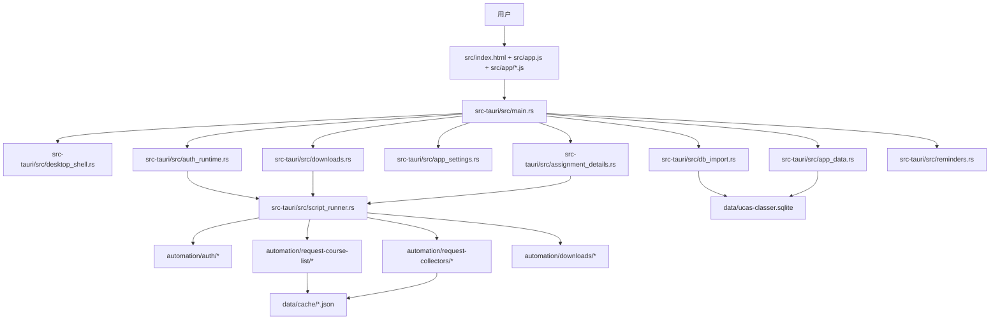

# UCAS Classer 程序 Map

更新时间：2026-03-31  
文档定位：当前主程序总图，回答“入口在哪里、数据怎么走、哪些文档还有效、哪些点值得继续收口”。

当前发布基线：`v1.1.1`

## 1. 当前结构总览

```mermaid
flowchart TD
  User[用户]
  FE[src/index.html + src/app.js + src/app/*.js]
  TA[src-tauri/src/main.rs]
  Shell[src-tauri/src/desktop_shell.rs]
  Runtime[src-tauri/src/auth_runtime.rs]
  Data[src-tauri/src/app_data.rs]
  Settings[src-tauri/src/app_settings.rs]
  Importer[src-tauri/src/db_import.rs]
  Downloads[src-tauri/src/downloads.rs]
  AssignmentCache[src-tauri/src/assignment_details.rs]
  Reminders[src-tauri/src/reminders.rs]
  Runner[src-tauri/src/script_runner.rs]
  Auth[automation/auth/*]
  CourseList[automation/request-course-list/*]
  Collectors[automation/request-collectors/*]
  DownloadScripts[automation/downloads/*]
  Cache[data/cache/*.json]
  DB[data/ucas-classer.sqlite]

  User --> FE
  FE --> TA
  TA --> Shell
  TA --> Runtime
  TA --> Data
  TA --> Settings
  TA --> Importer
  TA --> Downloads
  TA --> AssignmentCache
  TA --> Reminders
  Runtime --> Runner
  Downloads --> Runner
  AssignmentCache --> Runner
  Runner --> Auth
  Runner --> CourseList
  Runner --> Collectors
  Runner --> DownloadScripts
  CourseList --> Cache
  Collectors --> Cache
  Importer --> DB
  Data --> DB
```

## 2. 分层职责

### 2.1 前端层

- 入口：
  - `src/index.html`
  - `src/app.js`
- 模块：
  - `src/app/bridge.js`
  - `src/app/course-renderer.js`
  - `src/app/detail-controller.js`
  - `src/app/dock-controller.js`
  - `src/app/download-controller.js`
  - `src/app/settings-controller.js`
  - 以及其它纯工具模块

当前结论：

- `app.js` 已经回落为页面 orchestration 入口
- 设置、下载、详情、dock、课程渲染都已经拆出模块
- 前端当前不是“大文件失控”，而是进入“按模块继续做减法”的阶段

### 2.2 Rust 运行层

- `src-tauri/src/main.rs`
  - Builder、state 注册、command 注册
- `src-tauri/src/desktop_shell.rs`
  - 主窗口、dock、tray、外链打开、文件夹选择器
- `src-tauri/src/auth_runtime.rs`
  - runtime scheduler、auth check、collect、db import 编排
- `src-tauri/src/app_settings.rs`
  - 设置持久化与默认值
- `src-tauri/src/app_data.rs`
  - 从 SQLite 读 dashboard
- `src-tauri/src/db_import.rs`
  - cache JSON -> SQLite
- `src-tauri/src/downloads.rs`
  - 下载桥接
- `src-tauri/src/assignment_details.rs`
  - 作业详情缓存与加载
- `src-tauri/src/reminders.rs`
  - full import 后的提醒基线与系统提醒
- `src-tauri/src/script_runner.rs`
  - Rust -> Node 自动化脚本桥

当前结论：

- `main.rs` 已不再承载大块壳层实现
- `desktop_shell.rs` 已成为桌面窗口行为的主边界
- `auth_runtime.rs` 当前要点不再是重构，而是继续收口 auth 失败分类、interrupt 恢复与调度手感

### 2.3 TS request / automation 层

- `automation/auth/*`
  - 登录、登录态校验、已登录页面打开
- `automation/request-course-list/*`
  - 课程列表采集
- `automation/request-collectors/*`
  - 模块入口、资料、通知、作业、作业详情
- `automation/downloads/*`
  - 受保护下载
- `automation/shared/*`
  - request 主线共享类型与工具

当前结论：

- 解析域已经拆成 `request-core / material-parser / notice-parser / assignment-parser`
- `full-collect.ts` 已更像 orchestration
- `assignment-parser.ts` 已补上混合作业列表场景
- `common.ts` 当前只是兼容出口，不应继续变厚

## 3. 当前关键主线

### 3.1 登录与调度

1. 前端启动
2. `start_runtime_scheduler`
3. Rust runtime 先做 `auth:check`
4. auth 正常则继续 collect；失败则进入 interrupt / 登录恢复
5. interrupt 期间允许手动 `check` 作为探测恢复
6. 启动时固定做一轮 `full`
7. 后台自动 collect 默认走 `summary`

### 3.2 数据采集与导库

1. `request-course-list` 拉课程列表
2. `request-collectors` 拉模块入口与摘要/详情
3. 写入 `data/cache/*.json`
4. 仅 `full` 成功后触发 `db_import`
5. 前端从 SQLite 读取 dashboard

### 3.3 下载

1. 前端计算最终 `relativeSubdir`
2. Rust 只做规范化和脚本桥接
3. Node 下载脚本按相对目录落盘
4. 资料批量下载会保留资料树文件夹层级
5. package 新安装默认目录为系统 `Downloads\\UCAS Classer`

### 3.4 作业详情

1. 点开作业详情
2. 若有缓存且摘要未变，直接读缓存
3. 否则 TS request 抓取详情页
4. Rust 写回 `assignment_detail_cache`
5. 前端显示富文本详情

### 3.5 提醒

1. full import 成功
2. Rust 读取 `reminder-state.json`
3. 对比本轮 notice/material/assignment 是否有新增
4. 按课程聚合系统提醒
5. 更新提醒基线

## 4. 当前有效文档

| 文档 | 用途 | 当前状态 |
| --- | --- | --- |
| `docs/development-handoff.md` | 总交接入口 | 当前有效 |
| `docs/program-map.md` | 程序总图 | 当前有效 |
| `docs/v1.1.x-v1.3.0-roadmap.md` | 当前路线 | 当前有效 |
| `docs/package-runtime-sync.md` | 主仓 / package 同步边界 | 当前有效 |
| `docs/archive-completed/v1.0.1-v1.1.0progress.md` | 历史版本进度 | 已归档 |
| `docs/archive-completed/*` | 已完成审计与临时文档 | 已归档 |
| `docs/archive-plans/*` | 历史计划 | 已归档 |

## 5. 当前值得继续收口的点

### 5.1 前端

- `detail-controller.js` 和 `modal-ui.js` 还可以继续压重复 builder
- 设置弹窗和详情弹窗还有一部分样板 UI 可以继续抽平
- 作业详情中的图片与复杂正文还值得再做一轮可读性打磨

### 5.2 Rust

- `main.rs` 里的 command facade 还能继续压薄
- `script_runner.rs` 的脚本名协议仍是字符串约定
- auth 失败分类目前还偏保守，离线恢复与 cookie 失效的边界需要继续观察

### 5.3 TS

- `full-collect.ts` 里 fingerprint / summary 写出逻辑还能继续收口
- assignment 详情与列表解析应继续覆盖更多真实课程样本
- `common.ts` 后续应保持薄兼容层，不再承载实现

## 6. 当前不要误判的点

- `ucasclasser-package/` 不是主仓权威源码
- package 打包端必须继续走系统路径存储
- 登录成功会直接覆写 `storage-state`，不必把“先 reset”当成必要步骤
- `auth:check` 失败不等于应立即清空本地 cookie
- 独立图片预览窗口尝试已经回退，不属于当前稳定功能
- `scripts/sync-package-runtime.mjs --check` 仍可能存在误报，不能单靠它判断同步失败

## 7. 一句话判断

当前主程序已经进入“结构基本成型，后续按模块继续做减法和打磨体验”的阶段。`1.1.x` 先把作业详情与运行时细节做稳，`1.2.0` 适合作为稳定性和体验收口版，`1.3.0` 再把课表与待办整合进主线。
